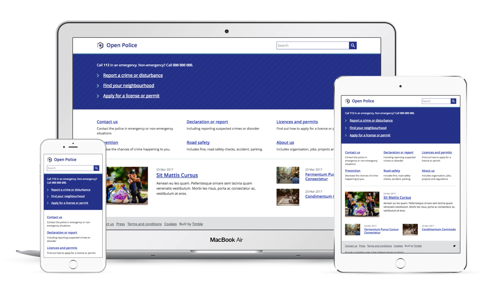

# Belgian Police Internet Platform

An **open government platform** specifically built for the internet websites of the Belgian Police that allows any Police zone to create an open data site. It uses a component based architecture. Written in PHP, HTML, CSS and Javascript. Made by [passionate open source technologists](http://www.timble.net/about/).

Check an example website at [www.lokalepolitie.be/leuven](http://www.lokalepolitie.be/leuven) or visit the project's website at [www.openpolice.be](http://www.openpolice.be/).

## Benefits

### Accessibility

* Conforms to [WCAG 2.0](http://www.w3.org/TR/WCAG20/) level AAA
* Leverages [WAI-ARIA](http://www.w3.org/TR/wai-aria/) & [HTML5](http://www.w3.org/TR/html5/) to further enhance accessibility

### Interoperability

* Support for HTML data ([Microformats.org](http://www.microformats.org/), [Schema.org](http://www.schema.org/))

### Mobile-First Responsive Web Design

* Following a Progressive Enhancement strategy
* Optimized for performance

## Installation

You can run the project easily with the supplied Vagrantfile - make sure you understand what [Vagrant](http://vagrantup.com/) is.

* Install [Composer](http://getcomposer.org/doc/00-intro.md)
* Install [VirtualBox](http://www.virtualbox.org/)
* Install [Vagrant](http://www.vagrantup.com/downloads.html)
* Clone this repository
* Go to the repository folder and bootup the server
    ```$ vagrant up```
* Add the following line to your hosts file
    ```192.168.52.10 police.dev phpmyadmin.police.dev```
* You can now access the sample site at [police.dev/9999](http://police.dev/9999)

### Access

* The example site application is available at [http://police.dev/9999](http://police.dev/9999).
* The example admin application is available at [http://police.dev/administrator/9999](http://police.dev/administrator/9999).

    ```
    email: demo@example.com
    password: police
    ```
* MailCatcher is available at [http://police.dev:1080/](http://police.dev:1080/)

### Theme development

We are using [Grunt](http://gruntjs.com/) to automate repetitive tasks like [Sass](http://sass-lang.com/) compilation, synchronised browser testing, etc.

* Install [node.js](http://nodejs.org/)
* Install [Grunt](http://gruntjs.com/): ```npm install -g grunt-cli```
* Go to the repository folder and install the dependencies: ```npm install```
* Finally run Grunt ```grunt```

### Vagrant command-line interface

You can use the following commands to manage the server:

* ```vagrant up``` to initially start the server
* ```vagrant ssh``` to SSH into the running Vagrant machine
* ```vagrant reload``` reboots the server
* ```vagrant halt``` powers the server down
* ```vagrant suspend``` & ```vagrant resume``` to make the server sleep/wake up
* ```vagrant destroy``` to stop and destroy all resources of the server

More information about the Vagrant command-line interface can be found at [docs.vagrantup.com](http://docs.vagrantup.com/v2/cli/index.html).

### Secure Shell

You can use the following commands to manage the platform:

* ```police reinstall``` to re-create the sample site.

First use the Vagrant command-line interface to access the Secure Shell: ```vagrant ssh```.

### Database migrations

Database migrations are being managed using [Phpmig](https://github.com/davedevelopment/phpmig).

The Vagrant box will setup everything for you. To make sure you have applied the latest database changes, browse to ```cd scripts/phpmig``` and execute ```bin/phpmig migrate```.

To see a list of all migrations and their status, run ```bin/phpmig status```. Use the ```bin/phpmig up <migration ID>```and ```bin/phpmig down <migration ID>``` commands to apply or undo specific migrations.

For more information, please refer to the [Phpmig GitHub page](https://github.com/davedevelopment/phpmig).

## Built on Open Source software

The Police Internet Platform is purely built on [an open source software stack](http://www.openpolice.be/stack/) and wouldn't be as productive without these projects around.


## Open Data resources

The Police Internet Platform leverages open data resources and and wouldn't be as productive without these open data projects.
We simply just want to say thank you to the following projects for helping us out:

* [Flemish Geographical Information Agency](https://www.agiv.be/)


## How to contribute?

Check our [contributing](CONTRIBUTING.md) guide.


## License

The files in this archive are released under the AGPLv3 license. You can find a copy of this license in [LICENSE](LICENSE.md).
